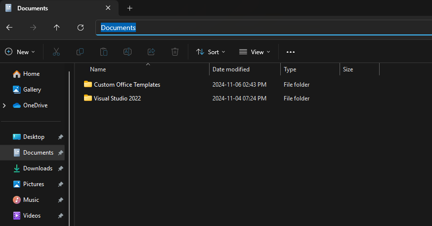
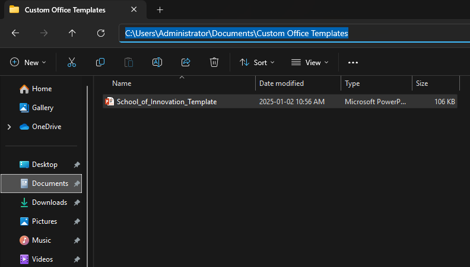
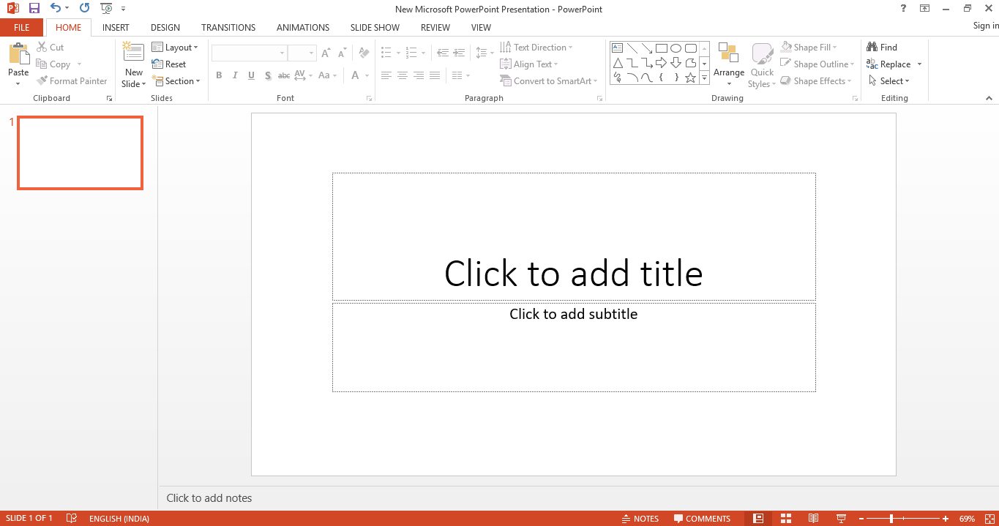
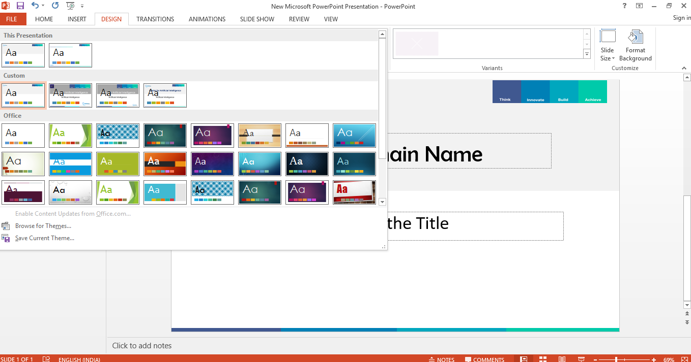
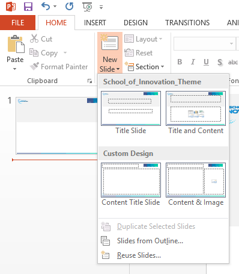
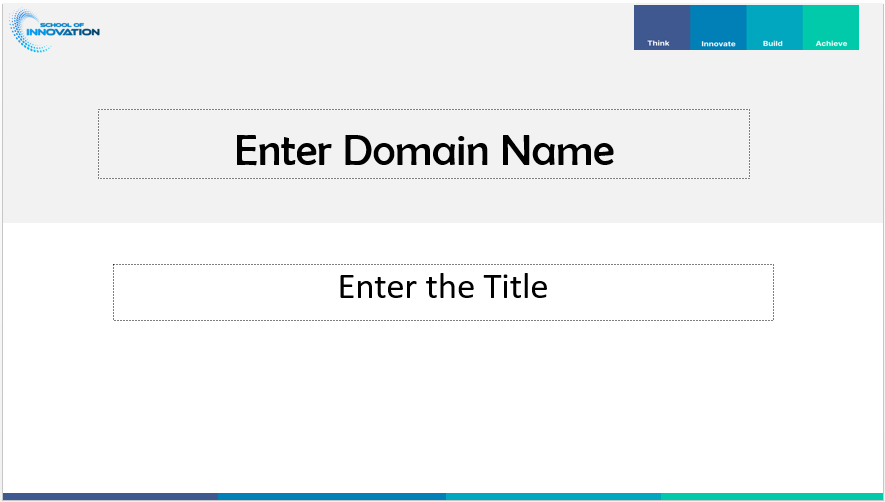
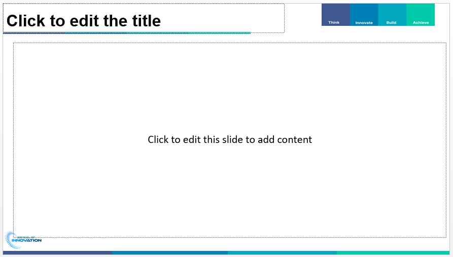
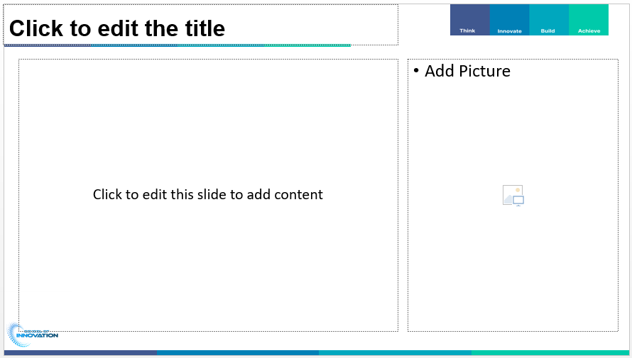

# School Of Innovation (Course Template)

This repository contains the official Slide Master template for **School Of Innovation**. Follow the instructions below to download, install, and apply the template to your presentations.

---
## 🎯 Features
- Professional design aligned with School of innovation's branding.
- Pre-defined slide layouts for various use cases.
- Consistent colors, fonts, and styles.

---

## 📥 Download the Template
 1. Navigate to the `Template/School_of_Innovation_Template.potx` file in this repository.
 2. Click **Download** to save the file to your computer.

---

## 🛠️ Setup Instructions

### **Step 1: Save the Template to Your Office Templates Folder**
Move the downloaded `.potx` file to your custom templates folder:
--

- **Windows:**  
  `C:\Users\<YourUsername>\Documents\Custom Office Templates`

- **Mac:**  
  `~/Library/Group Containers/UBF8T346G9.Office/User Content/Templates`

> **Note:** If the folder does not exist, create it manually.

---
### **Step 2: Apply the Template in PowerPoint**
1. Open PowerPoint.
2. Go to **File > New**.

3. Select **Custom > Custom Office Templates**.

4. Choose the template file (`School_of_Innovation_Template.potx`) to start using it and start adding the new slide and choose a particular Slide.

---
### **Powerpoint Slide (Version 1.0)**
Title Slide 

Content Slide 

Content Slide with adding a picture on the right side

## ✏️ Editing the Slide Master (Optional)
If you wish to edit the theme according to your domain needs , then you can do this by following the instructions.
 
1. Open the template in PowerPoint.
2. Go to **View > Slide Master**.
3. Make the desired changes.
4. Save the file again as a `.potx` template.

---
## 📚 Additional Resources
- [Microsoft Office Template Management Documentation](https://support.microsoft.com/en-us/office/create-and-use-your-own-template-in-office-190e5d66-1a7d-49b8-9651-e044376542d4)
- [PowerPoint Slide Master Guide](https://support.microsoft.com/en-us/office/what-is-a-slide-master-4d760649-f694-4c3a-93d3-97c43616f9eb)

---
## 🧾 Changelog
- **Version 1.0:** Initial release with default layouts and branding.

---
## 🛡️ License
This template is provided for internal use by **School Of Innovation** at KGISL Educational Institutions. Unauthorized distribution or modification is prohibited.

---
## 📩 Support
If you encounter any issues or need further assistance, please contact:
 **Mathi Yuvarajan T.K** | 
Email: mathiyuvarajan.tk@kgkite.ac.in